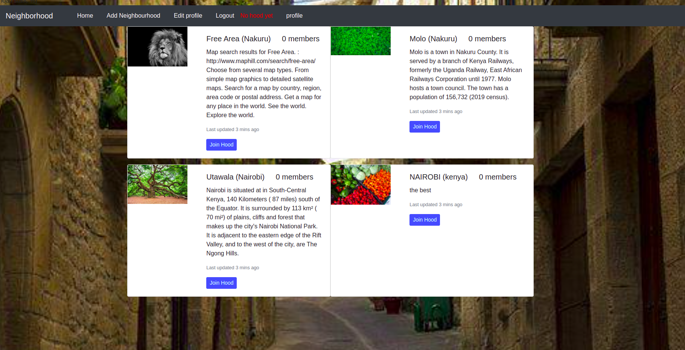

# Django-neighborhood-project

### By Elijah Mwangi Wangu.

## Table of content.

- [Description](#description)
- [Installation requirement](#installation)
- [Technology used](#technology used)
- [Reference](#reference)
- [Licence](#licence)
- [Authors Info](#author-info)

## Description
This is a web application that allows web developers to post their projects and they can be reviewed and the  projects can be graded in terms of userbility, design and content.

## Home Page

## Istallation

<ul>
   <li>go to a location of your liking in your file system choose a root folder and clone this repository  
   https://github.com/elijah-dot/Django-neighborhood-project
   </li>
   <li>open a code editor.any will work.</li>
</ul>
 
### Requerements
<ul>
<li>either a computer,smartphone er any coputing devise</li>
<li>An access to the internet</li>
<ul>

### Installation process

[Go back to the top](#Django-neighborhood-project)

## Technology used

<ul> 
<li>Html - which was used to build the structure of the pages</li>
<li>css- which was used to style the pages </li>
<li>bootstrap-which was used to make pages and images responsive</li>
<li>Django-which was used to give logic to the website</li>
</ul>

## Development

Want to contribute ?
 
<ul>
  <li>clone the repo<li>
  <li>find a root directory of your own in file system</li>
  <li>create a branch</li>
  <li>work on the project</li>
  <li>push to the branch</li>
  <li>create a pull request</li>
</ul>

## User Stories
These are the behaviours/features that the application implements for use by a user.

Users would like to:
* View all neighborhoods available submitted by any user.
* Search for businessess in the area.
* see emergency contacts available in the area.

## Admin Abilities
These are the behaviours/features that the application implements for use by the admin.

Admin should:
* Sign in to the application
* Add, Edit and Delete neighborhoods
* Delete neighborhoods
* Manage the application.

## Specifications
| Behaviour | Input | Output |
| :---------------- | :---------------: | ------------------: |
| Admin Authentication | **On demand** | Access Admin dashboard |
| Admin Authentication | **On demand, verify emails before proceeding** | Access Admin dashboard |
| Display all projects with grading | **Home page** | Clickable links to open neighborhoods in different sites |
| To add an neighborhoods  | **Through Admin dashboard and homepage** | Click on add and upload respectively|
| To edit profile and neighborhoods data  | **Through Admin dashboard** | Redirected to the  project form details and editing happens|
| To delete an neighborhoods  | **Through Admin dashboard** | click on project object and confirm by delete button|
| To search businesses by title | **Enter text in search bar** | Users can search by businesses Title|

## SetUp / Installation Requirements
### Prerequisites
* python3.8
* pip
* virtualenv
* Requirements.txt

### Cloning
* In your terminal:

        $ git clone https://github.com/elijah-dot/Django-neighborhood-project
        $ cd Awards

## Running the Application
* Creating the virtual environment

        $ python3.8 -m venv --without-pip virtual
        $ source virtual/bin/activate
        $ curl https://bootstrap.pypa.io/get-pip.py | python

* Installing Django and other Modules

        $ see Requirements.txt

* To run the application, in your terminal:

        $ python3.8 manage.py runserver

## Testing the Application
* To run the tests for the class files:

        $ python3.8 manage.py test projects

## Technologies Used
* Python3.8
* Django  rest framework and postgresql database

## Known Bugs

* search button is not working

## licence

copyright (c) [2022] [https://github.com/elijah-dot/Django-neighborhood-project/blob/master/LICENSE]

## authors info

linked - [Elijah Mwangi Wangu]
(https://github.com/elijah-dot/Django-neighborhood-project)

email - [Elijah Mwangi Wangu]
(elijahwangu91@gmail.com
)
